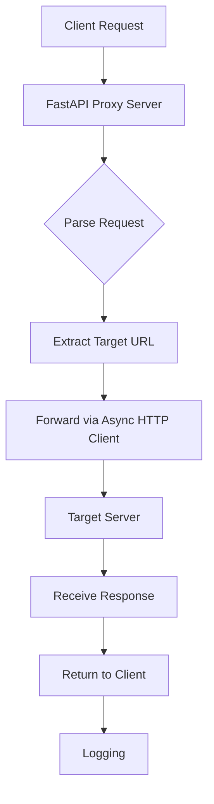

# FastAPI HTTP Proxy Server - Implementation Plan

## Overview
This plan outlines the step-by-step implementation of a FastAPI-based HTTP proxy server compatible with Python's `requests` library `proxies` argument.

## Architecture

### System Components

### Key Design Decisions
1. **Async Forwarding**: Use `httpx.AsyncClient` for non-blocking request forwarding.
2. **Path-Based Routing**: The proxy will accept any HTTP method and path, forwarding to the target URL specified in request headers or query parameters.
3. **Compatibility**: Support both `http` and `https` schemes in the `proxies` dictionary.
4. **CORS**: Enable CORS middleware to allow browser-based clients.

## Dependencies
Update `pyproject.toml` with:
- `fastapi>=0.104.0`
- `uvicorn[standard]>=0.24.0`
- `httpx>=0.25.0`
- `python-multipart` (optional, for form data)

## Implementation Steps

### 1. Project Structure Setup
- Create `src/` directory with `__init__.py`
- Create `src/main.py` as FastAPI application entry point
- Create `src/proxy.py` for core proxy logic
- Create `src/config.py` for configuration management
- Create `tests/` directory for unit tests

### 2. Configuration Module
- Define settings using Pydantic `BaseSettings`
- Support environment variables for host, port, log level, CORS origins
- Default configuration: host=0.0.0.0, port=8000

### 3. FastAPI Application
- Initialize FastAPI app with CORS middleware
- Add health check endpoint (`/health`)
- Add root endpoint with documentation
- Implement catch-all route (`/{path:path}`) to handle all HTTP methods

### 4. Proxy Logic
- Extract target URL from request headers (`X-Target-URL`) or query parameter (`target_url`)
- Validate URL format and scheme
- Forward request using `httpx.AsyncClient` with same method, headers, body
- Preserve response status, headers, and body
- Handle errors (timeout, connection errors) with appropriate HTTP status

### 5. Requests Library Compatibility
- Ensure proxy accepts standard HTTP proxy format (`http://localhost:8000`)
- Document usage with `requests` library
- Provide example code snippet

### 6. Logging and Monitoring
- Implement structured logging
- Log request method, target URL, response status, duration
- Add metrics endpoint for basic monitoring

### 7. Testing
- Unit tests for proxy forwarding logic
- Integration tests with actual HTTP requests
- Test with `requests` library using proxy
- Mock external services for reliability

### 8. Documentation
- Update README.md with usage instructions
- Add API documentation (auto-generated by FastAPI)
- Create example scripts in `examples/` directory

### 9. Deployment Preparation
- Create Dockerfile for containerization
- Add startup script
- Configure for production (gunicorn with uvicorn workers)

## Validation Criteria

### Functional Requirements
- [ ] Proxy forwards HTTP GET requests correctly
- [ ] Proxy forwards HTTP POST with body
- [ ] Proxy handles HTTPS targets
- [ ] Works with `requests` library `proxies` parameter
- [ ] Returns appropriate error for invalid URLs
- [ ] Health endpoint returns 200 OK

### Non-Functional Requirements
- [ ] Response time under 100ms for local targets
- [ ] Handles concurrent requests (async)
- [ ] Memory usage stable under load
- [ ] Logs contain necessary debugging information

## Risk Assessment

| Risk | Mitigation |
|------|------------|
| Security: open proxy abuse | Limit to localhost by default, add authentication option |
| Performance: blocking I/O | Use async throughout, connection pooling |
| Complexity: URL parsing errors | Robust validation, clear error messages |
| Compatibility: requests library quirks | Test with various `requests` versions |

## Next Steps
1. Review this plan with stakeholders
2. Update dependencies in `pyproject.toml`
3. Begin implementation in Code mode
4. Iterate with testing and refinement

## Success Metrics
- Proxy server runs without errors
- Example usage with `requests` works as documented
- All tests pass
- Code follows project linting and formatting standards
