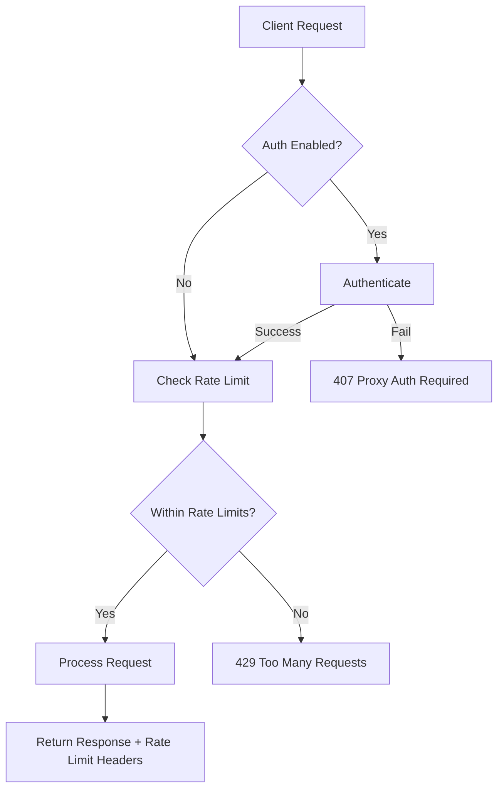
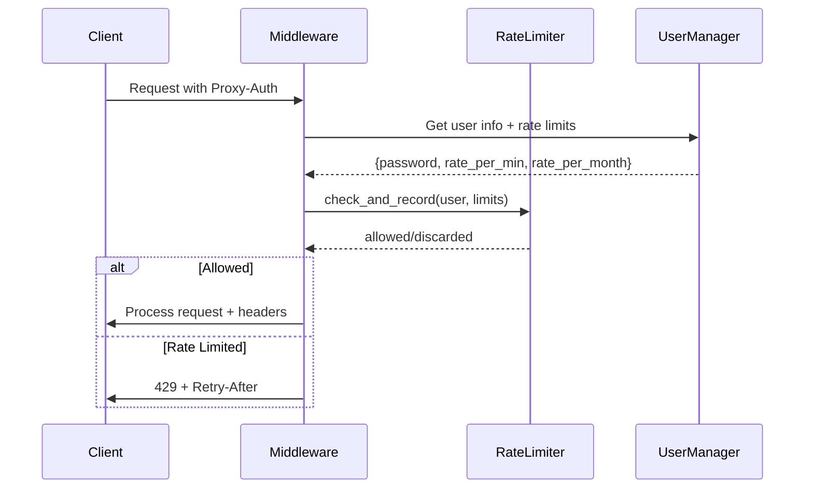

# Rate Limiting Feature Implementation Plan

## Overview
Add per-user rate limiting to the proxy server with two constraints:
- **Requests per minute**: Limit how many requests a user can make in a sliding 60-second window
- **Requests per month**: Limit how many requests a user can make in a sliding 30-day window

Both limits must be satisfied for a request to proceed.

## Architecture

### System Flow with Rate Limiting


### Data Flow


## Implementation Steps

### 1. Update users.json Format

**Current format:**
```json
{
    "alice": "password123",
    "bob": "secret456"
}
```

**New format:**
```json
{
    "alice": {
        "password": "password123",
        "rate_limit_per_minute": 60,
        "rate_limit_per_month": 10000
    },
    "bob": {
        "password": "secret456",
        "rate_limit_per_minute": 30,
        "rate_limit_per_month": 5000
    }
}
```

### 2. Update UserManager in src/auth.py

**Changes:**
- Modify `users` dict to store user objects instead of plain strings
- Update `validate_credentials` to access nested password field
- Add `get_user_rate_limits(username)` method to retrieve rate limits

### 3. Create Rate Limiter Module (src/ratelimit.py)

**Components:**
- `RateLimiter` class with:
  - `check_rate_limit(username: str, per_minute: int, per_month: int) -> tuple[bool, dict]`
  - Returns (allowed, headers_info)
- In-memory storage using `defaultdict(list)` to track request timestamps per user
- Sliding window algorithm to count requests within time windows

### 4. Create RateLimitMiddleware (src/ratelimit_middleware.py)

**Responsibilities:**
- After authentication, extract username from credentials
- Call rate limiter to check limits
- Return 429 with `Retry-After` header if limited
- Add rate limit headers to successful responses:
  - `X-RateLimit-Limit-Minute`
  - `X-RateLimit-Remaining-Minute`
  - `X-RateLimit-Limit-Month`
  - `X-RateLimit-Remaining-Month`

### 5. Update main.py

**Changes:**
- Import and add `RateLimitMiddleware` after authentication
- Conditionally enable based on config setting

### 6. Update config.py

**New settings:**
- `rate_limit_enabled: bool = os.getenv("RATE_LIMIT_ENABLED", "false")`

### 7. Write Tests

**Test cases:**
- Rate limit exceeded per minute
- Rate limit exceeded per month
- Rate limits reset correctly
- Multiple users with different limits
- Headers returned correctly
- 429 response format

### 8. Update Documentation

**Files to update:**
- `description.md` - Add rate limiting to features
- `features/rate-limiting.md` - New feature documentation
- `changelogs/` - Add changelog entry

## File Changes Summary

| File | Action |
|------|--------|
| `config/users.json` | Modify format |
| `src/auth.py` | Update UserManager |
| `src/ratelimit.py` | Create new module |
| `src/ratelimit_middleware.py` | Create new middleware |
| `src/config.py` | Add rate_limit_enabled setting |
| `src/main.py` | Integrate middleware |
| `tests/test_ratelimit.py` | Create new tests |
| `description.md` | Update documentation |
| `features/rate-limiting.md` | Create feature doc |

## Rate Limiting Algorithm

### Sliding Window Implementation

```python
import time
from collections import defaultdict
from typing import Dict, List, Tuple

class RateLimiter:
    def __init__(self):
        # Store timestamps for each user: {username: [timestamp1, timestamp2, ...]}
        self.requests: Dict[str, List[float]] = defaultdict(list)
    
    def _cleanup_old_requests(self, username: str, window_seconds: float) -> None:
        """Remove requests outside the sliding window."""
        cutoff = time.time() - window_seconds
        self.requests[username] = [
            ts for ts in self.requests[username] if ts > cutoff
        ]
    
    def check_rate_limit(
        self, 
        username: str, 
        per_minute: int, 
        per_month: int
    ) -> Tuple[bool, Dict[str, int]]:
        """Check if request is allowed. Returns (allowed, headers_info)."""
        # Cleanup old requests
        self._cleanup_old_requests(username, 60)  # 1 minute
        self._cleanup_old_requests(username, 30 * 24 * 3600)  # 30 days
        
        current_minute_count = len(self.requests[username])
        current_month_count = sum(
            1 for ts in self.requests[username] 
            if time.time() - ts < 30 * 24 * 3600
        )
        
        # Check both limits
        minute_allowed = current_minute_count < per_minute
        month_allowed = current_month_count < per_month
        
        allowed = minute_allowed and month_allowed
        
        # Record this request
        if allowed:
            self.requests[username].append(time.time())
        
        headers_info = {
            "limit_minute": per_minute,
            "remaining_minute": max(0, per_minute - current_minute_count - (0 if allowed else 1)),
            "limit_month": per_month,
            "remaining_month": max(0, per_month - current_month_count - (0 if allowed else 1)),
        }
        
        return allowed, headers_info
```

## Backward Compatibility

**Users with old format:**
- Gracefully handle existing users.json format (string password only)
- Use default rate limits if not specified: `per_minute=60`, `per_month=10000`

## Error Response Format

**429 Too Many Requests:**
```json
{
    "detail": "Rate limit exceeded",
    "error": "RateLimit-Exceeded",
    "retry_after": 30
}
```

Headers:
- `Retry-After: 30` (seconds until retry allowed)
- `X-RateLimit-Limit-Minute: 60`
- `X-RateLimit-Remaining-Minute: 0`
- `X-RateLimit-Limit-Month: 10000`
- `X-RateLimit-Remaining-Month: 9999`
